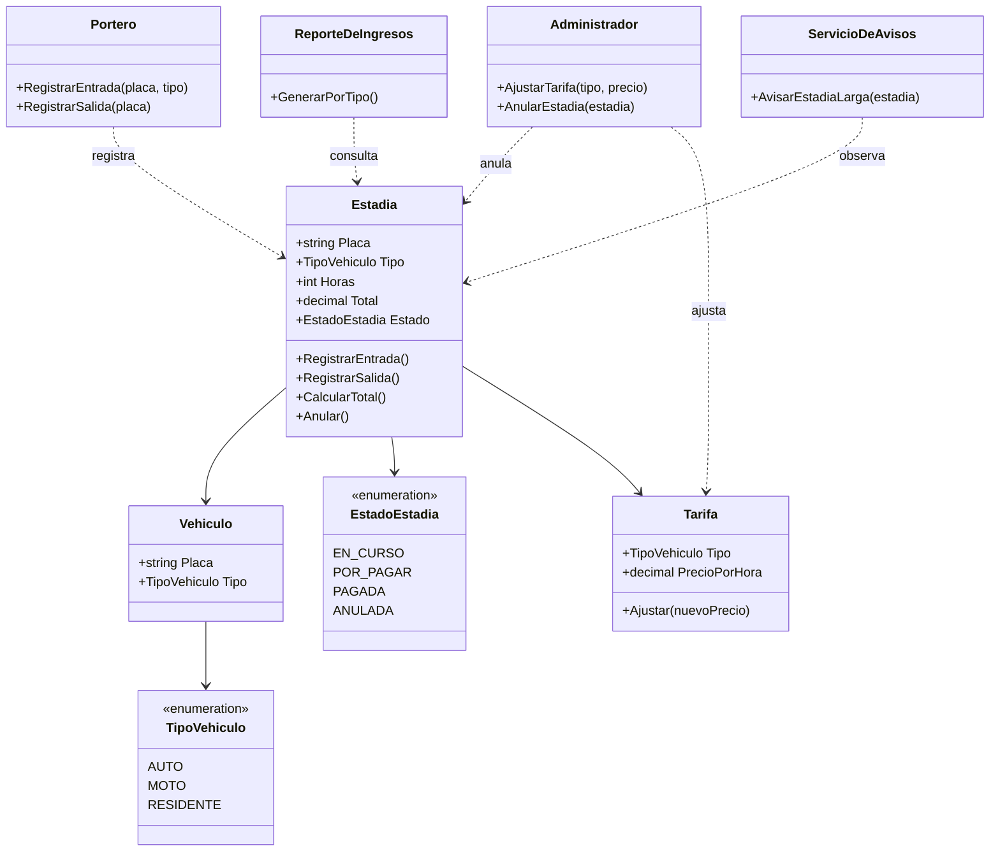

# Diagrama de Clases — Sistema de Parqueo "Torre Central"

**Nombre:** Ronaldo Melgarejo Cardozo

```mermaid
classDiagram
    class Vehiculo {
        +string Placa
        +TipoVehiculo Tipo
    }

    class TipoVehiculo {
        <<enumeration>>
        AUTO
        MOTO
        RESIDENTE
    }

    class Estadia {
        +string Placa
        +TipoVehiculo Tipo
        +int Horas
        +decimal Total
        +EstadoEstadia Estado
        +RegistrarEntrada()
        +RegistrarSalida()
        +CalcularTotal()
        +Anular()
    }

    class EstadoEstadia {
        <<enumeration>>
        EN_CURSO
        POR_PAGAR
        PAGADA
        ANULADA
    }

    class Tarifa {
        +TipoVehiculo Tipo
        +decimal PrecioPorHora
        +Ajustar(nuevoPrecio)
    }

    class ReporteDeIngresos {
        +GenerarPorTipo()
    }

    class ServicioDeAvisos {
        +AvisarEstadiaLarga(estadia)
    }

    class Portero {
        +RegistrarEntrada(placa, tipo)
        +RegistrarSalida(placa)
    }

    class Administrador {
        +AjustarTarifa(tipo, precio)
        +AnularEstadia(estadia)
    }

    Vehiculo --> TipoVehiculo
    Estadia --> Vehiculo
    Estadia --> EstadoEstadia
    Estadia --> Tarifa
    Portero ..> Estadia : registra
    Administrador ..> Estadia : anula
    Administrador ..> Tarifa : ajusta
    ReporteDeIngresos ..> Estadia : consulta
    ServicioDeAvisos ..> Estadia : observa
```
