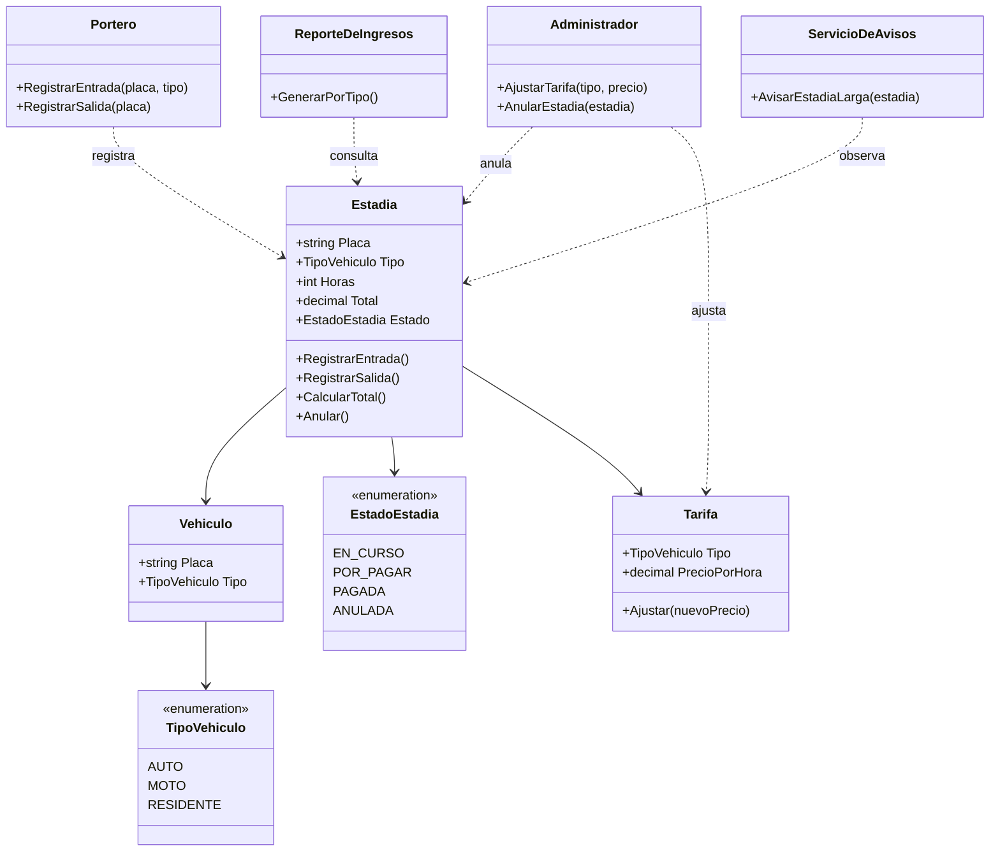

# Diagrama de Clases — Sistema de Parqueo "Torre Central"

**Autor:** [TU NOMBRE COMPLETO AQUÍ]

## Requerimientos analizados

**Sustantivos candidatos a clase:**
- Estadia, Vehiculo, Auto, Moto, Residente, Tarifa, TipoVehiculo
- Portero, Administrador, Reporte, Aviso, Estado

**Verbos candidatos a método:**
- registrar entrada, registrar salida, calcular tarifa, pagar
- anular, ajustar tarifa, avisar (24h), reportar ingresos

**Filtro (¿tiene datos Y comportamiento?):**
- `Estadia` → clase (placa, horas, total, estado)
- `Vehiculo` → clase (placa, tipo)
- `Tarifa` → clase (precio por hora, tipo)
- `Estado` → enum (EnCurso, PorPagar, Pagada, Anulada)
- `placa`, `horas`, `total` → atributos
- `avisar` → método de Estadia o servicio externo

## Diagrama (Mermaid)

## Relaciones y multiplicidad

| Relación | Tipo | Multiplicidad | Por qué |
|----------|------|---------------|---------|
| Vehiculo → TipoVehiculo | Composición | 1 a 1 | Cada vehículo tiene un tipo |
| Estadia → Vehiculo | Asociación | 1 a 1 | Una estadía pertenece a un vehículo |
| Estadia → Tarifa | Dependencia | 1 a 1 | La estadía consulta la tarifa vigente |
| Portero → Estadia | Asociación | 1 a 0..* | Un portero registra varias estadías |
| Administrador → Estadia | Asociación | 1 a 0..* | Un admin anula varias estadías |
| ServicioDeAvisos → Estadia | Observación | 1 a 0..* | Un servicio observa varias estadías |

## Notas de diseño

- **`Estadia`** es la clase central: conoce su vehículo, sus horas, su tarifa, su estado.
- **`EstadoEstadia`** es un enum: los 4 estados del requerimiento (en curso → por pagar → pagada / anulada).
- **`Tarifa`** se separa para que el administrador pueda ajustarla sin tocar la estadía.
- **`ServicioDeAvisos`** se marca como observador: **aquí entra el patrón Observer** (Parte 3).
- **`ReporteDeIngresos`** consulta las estadías pagadas, agrupadas por tipo.
